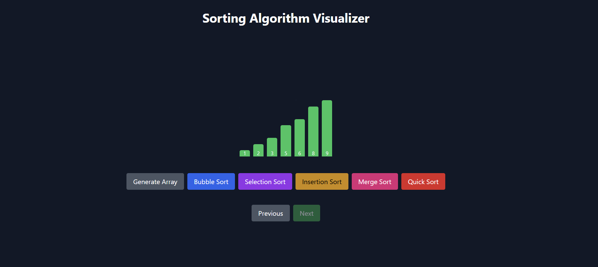

# Sorting Visualizer

A web application to visualize sorting algorithms step by step with colors and numbers.

## Features
- Bubble Sort, Selection Sort, Insertion Sort, Merge Sort, Quick Sort
- Step-by-step visualization with Next/Previous controls
- Color-coded bars to track comparisons and swaps
- Generate random arrays

## Screenshot

## Tech Stack
- React.js
- JavaScript
- Tailwind CSS
- HTML & CSS

